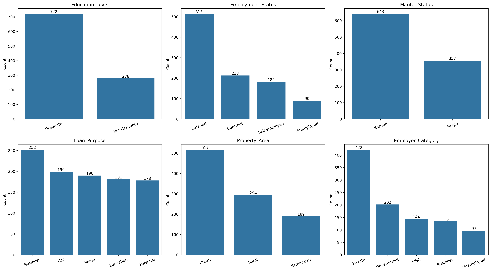
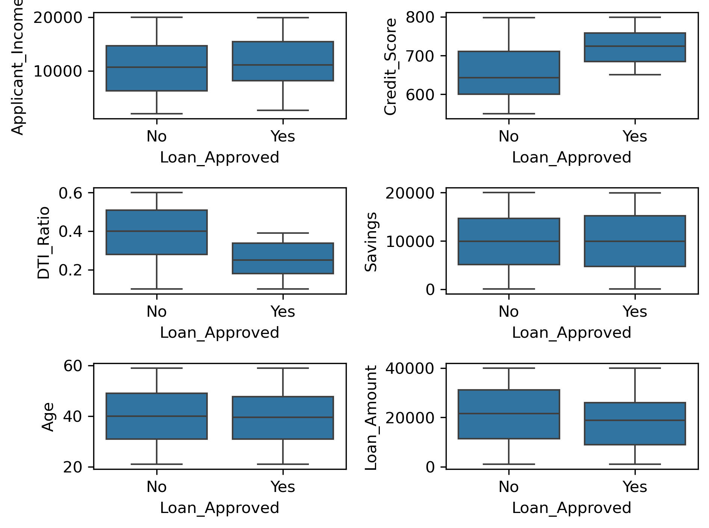
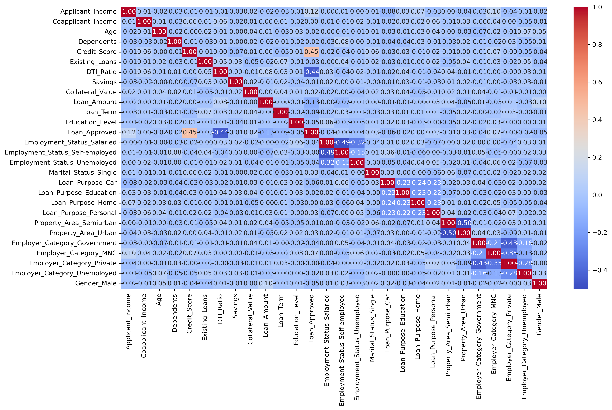

# Credit-Wise Loan

A practical machine learning project for predicting whether a loan application should be approved or rejected using historical applicant data.

> This project aims to support faster and more consistent loan decision-making while reducing human bias and manual effort.

---

## 📌 Project Overview

Credit-Wise Loan is an end-to-end supervised learning project that uses classification models to predict loan approval outcomes. The system learns patterns from past applications and helps financial institutions make better decisions.

### Key Objectives

- Automate loan approval prediction
- Reduce manual verification effort
- Minimize risky approvals

---

## 🧩 Problem Statement

A financial institution receives numerous loan applications each day. Manual review can be slow and may lead to:

- Incorrect rejections of deserving applicants
- Approval of high-risk borrowers
- Inconsistent decisions across cases

---

## 📊 Dataset Description

The dataset contains applicant information related to demographics, income, credit behavior, employment, and loan details.

You can explore the dataset here: [Kaggle Dataset](https://www.kaggle.com/datasets/supratimnag06/loan-approval-prediction-dataset)

### Important Features

| Feature            | Description                 |
| ------------------ | --------------------------- |
| Applicant_Income   | Applicant monthly income    |
| Coapplicant_Income | Co-applicant monthly income |
| Age                | Applicant age               |
| Dependents         | Number of dependents        |
| Credit_Score       | Credit score                |
| Existing_Loans     | Existing active loans       |
| DTI_Ratio          | Debt-to-income ratio        |
| Savings            | Applicant savings           |
| Collateral_Value   | Value of collateral         |
| Loan_Amount        | Requested loan amount       |
| Loan_Term          | Loan duration               |
| Education_Level    | Education qualification     |
| Employment_Status  | Employment category         |
| Employer_Category  | Employer type               |
| Marital_Status     | Marital status              |
| Property_Area      | Rural / Semiurban / Urban   |
| Gender             | Applicant gender            |
| Loan_Purpose       | Purpose of loan             |
| Loan_Approved      | Target variable             |

---

## 🔧 Data Preprocessing

The data was carefully cleaned and transformed before model training.

### Steps Performed

- Checked and handled missing values
- Removed duplicate records where necessary
- Converted data types into appropriate formats
- Encoded categorical variables for model compatibility

### Encoding Techniques Used

#### Label Encoding

Used for ordinal categorical features such as:
- Education_Level
- Loan_Approved

#### One-Hot Encoding

Used for nominal categorical features such as:
- Employment_Status
- Marital_Status
- Loan_Purpose
- Property_Area
- Employer_Category
- Gender

The first category was dropped to avoid the dummy variable trap.

---

## 📈 Exploratory Data Analysis (EDA)

Various visualizations were created to understand the data better and identify patterns.

### Visual Insights

The EDA helped reveal the following patterns:

| Summary             | Breakdown                                                             |
| ------------------- | --------------------------------------------------------------------- |
| Loan approval       | Approved = 30%, Not approved = 70%                                    |
| Gender              | Males = 621, Females = 379                                            |
| Employment status   | Salaried = 515, Contract = 213, Self employed = 182, Unemployed = 90  |
| Marital status      | Married = 643, Single = 357                                           |
| Property area       | Urban = 517, Rural = 294, Semiurban = 189                             |
| Employment category | Private = 422, Govt = 202, MNC = 144, Business = 135, Unemployed = 97 |

Additional EDA focus areas included credit score and income trends across approved and rejected loans, correlation between numerical features, and overall class balance.

---

## 🛠️ Feature Engineering

- Encoded categorical variables
- Prepared a model-ready numeric dataset
- Removed original categorical columns after transformation

---

## ⚙️ Machine Learning Workflow

1. Data cleaning
2. Exploratory data analysis
3. Feature engineering and encoding
4. Train-test split
5. Model training
6. Prediction and evaluation

---

## 🤖 Algorithms Used

The project is designed for classification-based loan approval prediction and can be tested with models such as:

- Logistic Regression
- K-Nearest Neighbors
- Naive Bayes

---

##  Evaluation Metrics

Common metrics used to measure model performance include:

- Accuracy
- Precision
- Recall
- F1 Score

##  Model Results
### Before Feature Engineering

| Model | Confusion Matrix | Precision | Recall | Accuracy | F1 Score |
| --- | --- | --- | --- | --- | --- |
| Logistic Regression | [[126, 13], [14, 47]] | 0.7833 | 0.7705 | 0.865 | 0.7769 |
| KNN | [[126, 13], [34, 27]] | 0.6750 | 0.4426 | 0.765 | 0.5347 |
| Naive Bayes | [[128, 11], [16, 45]] | 0.8036 | 0.7377 | 0.865 | 0.7692 |

Best model based on precision: Naive Bayes.

### After Feature Engineering

| Model | Confusion Matrix | Precision | Recall | Accuracy | F1 Score |
| --- | --- | --- | --- | --- | --- |
| Logistic Regression | [[125, 14], [10, 51]] | 0.7846 | 0.8361 | 0.880 | 0.8095 |
| KNN | [[128, 11], [31, 30]] | 0.7317 | 0.4918 | 0.790 | 0.5882 |
| Naive Bayes | [[129, 10], [18, 43]] | 0.8113 | 0.7049 | 0.860 | 0.7544 |

Best model after feature engineering based on precision: Naive Bayes.

---

## 👤 Author

**Muhammad Khan**

Machine Learning Enthusiast
---

If you found this project useful, consider giving it a star.
