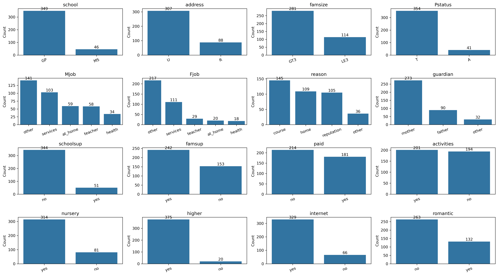
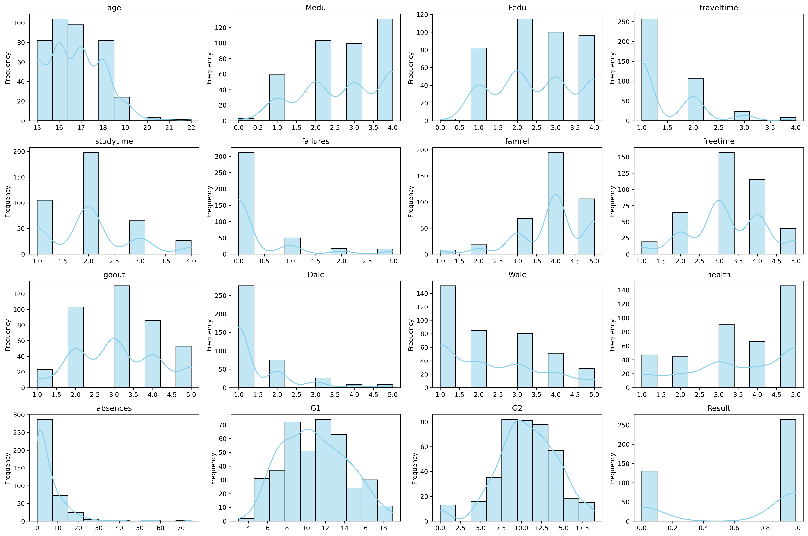
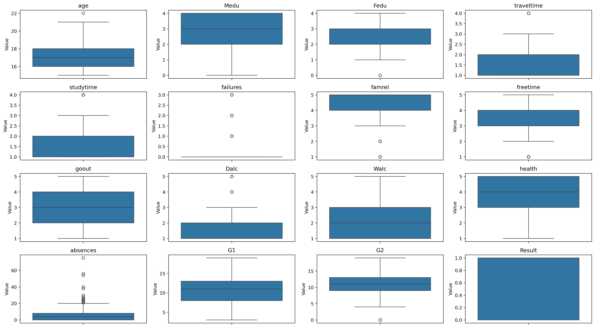

# Student Math Performance Analysis using Machine Learning

## Project Overview

This project analyzes the **Student Math Performance Dataset** to understand the factors affecting students' academic performance. The dataset was preprocessed and explored using **Exploratory Data Analysis (EDA)** before applying classification algorithms.

The objective is to predict whether a student will **Pass** or **Fail** based on demographic, family, social, lifestyle, and academic features.

---

## Problem Type

**Binary Classification**

The original target variable (`G3`) contains the final mathematics grade (0–20). It was converted into a binary target variable:

- **Pass (1):** G3 >= 10
- **Fail (0):** G3 < 10

The new target variable is named **Result**.

---


## Dataset

The dataset used in this project is available on Kaggle:
[Student Alcohol Consumption Dataset](https://www.kaggle.com/datasets/uciml/student-alcohol-consumption)

The project uses the **Student Mathematics (`student-mat.csv`)** dataset.

# 1. Data Loading
The dataset was initially inspected using:

- `head()`
- `tail()`
- `shape`
- `info()`
- `describe()`
- 
### Dataset Summary

- **Total Students:** 395
- **Total Features:** 33
- **Classification Target:** Result

---

# 2. Data Cleaning

Operation perfromed 

- Removed the unnecessary `Unnamed: 0` index column.
- Checked for missing values.
- Checked for duplicate records.
- Created the binary target variable (`Result`).
- Separated categorical and numerical features.

---

# 3. Exploratory Data Analysis (EDA)

EDA was performed to understand the structure, distributions, patterns, and unusual observations in the dataset.

The analysis was divided into:

1. Categorical Feature Analysis
2. Numerical Feature Analysis
3. Outlier Detection and Analysis

---

## 3.1 Categorical Feature Analysis

Bar charts were created for the following categorical features:

- School
- Address
- Family Size
- Parent Status
- Mother's Job
- Father's Job
- Reason for Choosing School
- Guardian
- School Support
- Family Support
- Paid Classes
- Activities
- Nursery
- Higher Education
- Internet Access
- Romantic Relationship

Each bar chart displays the frequency of each category.

The categorical feature visualization was saved as:



---

## 3.2 Numerical Feature Analysis

The numerical features were analyzed using statistical summaries, distributions, and boxplots.

The numerical features include:

- Age
- Mother's Education (`Medu`)
- Father's Education (`Fedu`)
- Travel Time (`traveltime`)
- Study Time (`studytime`)
- Past Failures (`failures`)
- Family Relationship (`famrel`)
- Free Time (`freetime`)
- Going Out (`goout`)
- Weekday Alcohol Consumption (`Dalc`)
- Weekend Alcohol Consumption (`Walc`)
- Health (`health`)
- Absences (`absences`)
- First Period Grade (`G1`)
- Second Period Grade (`G2`)
- Result

---

## 3.3 Numerical Data

Histogram were created to visualize:

- Median
- Interquartile range
- Data spread
- Potential statistical outliers

The boxplots were generated using the existing `numeric_columns` list.



---

# 4. Outlier Detection and Analysis

Outlier detection was performed using **boxplots** and the **Interquartile Range (IQR) method**.

The IQR is calculated as:

```text
IQR = Q3 - Q1
```

The lower and upper boundaries are:

```text
Lower Bound = Q1 - 1.5 × IQR
Upper Bound = Q3 + 1.5 × IQR
```



Values below the lower bound or above the upper bound were identified as **potential statistical outliers**.


---

## 4.2 Outlier Detection Results

The IQR method identified the following potential outliers:

| Feature | Potential Outliers |
|---|---:|
| Age | 1 |
| Medu | 0 |
| Fedu | 2 |
| Traveltime | 8 |
| Studytime | 27 |
| Failures | 83 |
| Famrel | 26 |
| Freetime | 19 |
| Goout | 0 |
| Dalc | 18 |
| Walc | 0 |
| Health | 0 |
| Absences | 15 |
| G1 | 0 |
| G2 | 13 |
| Result | 0 |

---

The presence of a statistical outlier does **not automatically mean that the observation is incorrect**.

Several variables in this dataset are discrete or ordinal features. For example:

- `studytime`
- `traveltime`
- `failures`
- `famrel`
- `freetime`
- `Dalc`

For these variables, a value identified as an outlier by the IQR method can still represent a valid student response.

Therefore:

> **Statistical outlier ≠ incorrect data**

Outliers were investigated before deciding whether they should be removed or transformed.

---

# 6. Absences Outlier Analysis

The `absences` feature showed the clearest presence of extreme observations in the boxplot.

The IQR method identified **15 potential outliers**.

The identified absence values ranged from:

- **21 absences**
- to **75 absences**

These observations were further investigated using:

- `absences`
- `G1`
- `G2`
- `Result`

---

## 6.1 Absence Outlier Table

| Absences | G1 | G2 | Result |
|---:|---:|---:|---:|
| 21 | 17 | 18 | 1 |
| 22 | 6 | 6 | 0 |
| 22 | 9 | 9 | 0 |
| 22 | 13 | 10 | 1 |
| 23 | 13 | 13 | 1 |
| 24 | 18 | 18 | 1 |
| 25 | 7 | 10 | 1 |
| 26 | 7 | 6 | 0 |
| 28 | 10 | 9 | 0 |
| 30 | 8 | 8 | 0 |
| 38 | 8 | 9 | 0 |
| 40 | 13 | 11 | 1 |
| 54 | 11 | 12 | 1 |
| 56 | 9 | 9 | 0 |
| 75 | 10 | 9 | 0 |

- Potential statistical outliers were identified using the IQR method.
- The outliers were investigated instead of being automatically deleted.
- High absence values were retained.
- Extreme values in ordinal features were retained when they represented valid responses.
- No obvious data-entry errors were identified in the investigated absence outliers.
- No automatic outlier removal was performed.

This approach preserves genuine student observations and avoids unnecessary loss of information.

---


# 8. Feature Encoding and Standardization

After completing the exploratory data analysis and outlier investigation, the categorical and numerical features were prepared for machine learning.

The following preprocessing techniques were used:

- **One-Hot Encoding** for categorical features
- **Standardization** for numerical features

---


## Student Demographics

The EDA showed that:

- Most students are between **15 and 18 years old**.
- Most students attend **GP School**.
- Most students live in **urban areas**.
- Most students belong to families with more than three members.

---

## Education

The analysis indicates that:

- Most parents have medium to high education levels.
- Study time is commonly concentrated around category **2**.
- The majority of students have **no previous academic failures**.
- A large proportion of students intend to pursue higher education.

---

## Family and Social Factors

The analysis indicates that:

- Many students report good family relationships.
- Family educational support is common.
- Most students are cared for by their mother.
- Students show different levels of social activity and family support.

---

## Lifestyle

The EDA indicates that:

- Weekday alcohol consumption is generally low.
- Weekend alcohol consumption is slightly higher.
- Most students report relatively good health.
- Most students have internet access at home.

---

## Academic Performance

The academic features show that:

- G1 and G2 represent the first and second period grades.
- Most students have moderate-to-high academic scores.
- G1 does not show major statistical outliers.
- G2 contains a small number of potential extreme observations.
- Absences contain several high-value observations.
- High absence values were investigated and retained as potentially valid observations.

---

# 9. Important EDA Findings

The most important findings from the exploratory analysis are:

1. The dataset contains **395 students**.
2. The target variable contains **265 passing students and 130 failing students**.
3. The target classes are moderately imbalanced.
4. Categorical features were analyzed using frequency bar charts.
5. Numerical features were analyzed using distributions and boxplots.
6. Potential outliers were identified using the IQR method.
7. `Absences` contained **15 potential outliers**.
8. The highest investigated absence value was **75**.
9. The absence outliers were examined using G1, G2, and Result.
10. No obvious data-entry errors were identified among the investigated absence observations.
11. High absence observations were therefore retained.
12. Several ordinal features contained statistical outliers, but these values can represent valid student responses.
13. Outliers were not automatically removed from the dataset.
14. The dataset is now ready for the next preprocessing and machine learning stages.

---

# 10. Technologies Used

- Python
- Pandas
- NumPy
- Matplotlib
- Seaborn
- Scikit-learn

---

### Important Target-Feature Consideration
The target variable `Result` was created from `G3`:

- `G3 >= 10` → Pass (`1`)
- `G3 < 10` → Fail (`0`)

Therefore, `G3` must not be used as an input feature when training the classification models because it directly determines the target and would cause data leakage.

---

# 12. Machine Learning Models

Three supervised learning classification algorithms were trained and evaluated:

## Logistic Regression

A linear classification algorithm used as the baseline model for binary classification.

## Naive Bayes

A probabilistic classification algorithm based on Bayes' theorem.

## K-Nearest Neighbors (KNN)

A distance-based classification algorithm that predicts the class based on nearby observations.

---

# 13. Model Evaluation

The models were evaluated using:

- Accuracy
- Precision
- Recall
- F1-Score
- Classification Report

### Meaning of Evaluation Metrics

- **Accuracy:** The percentage of all predictions that were correct.
- **Precision:** When the model predicts Pass, how often that prediction is correct.
- **Recall:** The percentage of actual Pass students that the model successfully identifies.
- **F1-Score:** A balanced measure combining Precision and Recall.

---

## 13.1 Logistic Regression Results

Logistic Regression achieved the following results:

| Metric | Score |
|---|---:|
| Accuracy | **91.14%** |
| Precision | **94.12%** |
| Recall | **92.31%** |
| F1-Score | **93.20%** |

### Classification Report

| Class | Meaning | Precision | Recall | F1-Score | Support |
|---|---|---:|---:|---:|---:|
| 0 | Fail | 0.86 | 0.89 | 0.87 | 27 |
| 1 | Pass | 0.94 | 0.92 | 0.93 | 52 |
| **Overall** | | **0.91** | **0.91** | **0.91** | **79** |

### Interpretation

Logistic Regression correctly classified approximately **91% of the test students**.

Its precision of **94.12%** indicates that its Pass predictions were highly reliable. Its recall of **92.31%** indicates that it successfully identified most of the students who actually passed.

The F1-score of **93.20%** shows a strong balance between precision and recall.

---

## 13.2 Naive Bayes Results

Naive Bayes achieved the following results:

| Metric | Score |
|---|---:|
| Accuracy | **79.75%** |
| Precision | **81.03%** |
| Recall | **90.38%** |
| F1-Score | **85.45%** |

### Classification Report

| Class | Meaning | Precision | Recall | F1-Score | Support |
|---|---|---:|---:|---:|---:|
| 0 | Fail | 0.76 | 0.59 | 0.67 | 27 |
| 1 | Pass | 0.81 | 0.90 | 0.85 | 52 |
| **Overall** | | **0.79** | **0.80** | **0.79** | **79** |

### Interpretation

Naive Bayes correctly classified approximately **80% of the test students**.

The model achieved a relatively high recall of **90.38%**, meaning that it identified most students who actually passed. However, its overall accuracy and F1-score were considerably lower than Logistic Regression.

The model had more difficulty identifying the Fail class, with a recall of **59%**.

---

## 13.3 K-Nearest Neighbors (KNN) Results

KNN achieved the following results:

| Metric | Score |
|---|---:|
| Accuracy | **79.75%** |
| Precision | **80.00%** |
| Recall | **92.31%** |
| F1-Score | **85.71%** |

### Classification Report

| Class | Meaning | Precision | Recall | F1-Score | Support |
|---|---|---:|---:|---:|---:|
| 0 | Fail | 0.79 | 0.56 | 0.65 | 27 |
| 1 | Pass | 0.80 | 0.92 | 0.86 | 52 |
| **Overall** | | **0.80** | **0.80** | **0.79** | **79** |

### Interpretation

KNN correctly classified approximately **80% of the test students**.

Its recall for the Pass class was **92.31%**, which means it successfully identified most students who actually passed.

However, KNN had difficulty identifying Fail students, with a recall of **56%**. Its overall performance was therefore lower than Logistic Regression.

---

# 14. Model Comparison

The final model comparison is:

| Model | Accuracy | Precision | Recall | F1-Score |
|---|---:|---:|---:|---:|
| **Logistic Regression** | **91.14%** | **94.12%** | **92.31%** | **93.20%** |
| KNN | 79.75% | 80.00% | 92.31% | 85.71% |
| Naive Bayes | 79.75% | 81.03% | 90.38% | 85.45% |

### Best Performing Model

**Logistic Regression is the best-performing model among the three evaluated algorithms.**

It achieved:

- Highest **Accuracy: 91.14%**
- Highest **Precision: 94.12%**
- Highest **F1-Score: 93.20%**
- Recall of **92.31%**

Although KNN also achieved a recall of **92.31%**, Logistic Regression provided much better overall performance and a substantially higher F1-score.

---

# 15. Summary 

Three classification algorithms were evaluated: Logistic Regression, Naive Bayes, and K-Nearest Neighbors.

Among the evaluated models, **Logistic Regression performed the best**, achieving **91.14% accuracy**, **94.12% precision**, **92.31% recall**, and **93.20% F1-score**.

The results demonstrate that Logistic Regression can effectively classify students into Pass and Fail categories using the prepared demographic, family, social, lifestyle, and academic features.

# 

